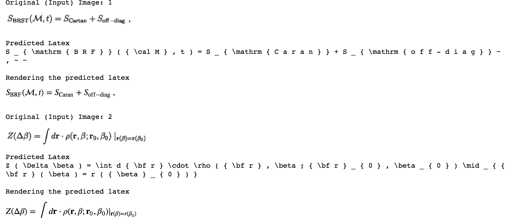
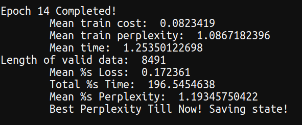

# Convert Img To Latex

## Abstract
**Implement an attention model that takes an image of a PDF math formula, and outputs the characters of the LaTeX source that generates the formula.**

	This is a tensorflow implementation of the HarvardNLP paper: What You Get Is What You See: A Visual Markup Decompiler.
The model graphic is here:
<p align="center"></p>

An example input is a rendered LaTeX formula:

<p align="center"></p>

The goal is to infer the LaTeX formula that can render such an image:

```
 d s _ { 1 1 } ^ { 2 } = d x ^ { + } d x ^ { - } + l _ { p } ^ { 9 } \frac { p _ { - } } { r ^ { 7 } } \delta ( x ^ { - } ) d x ^ { - } d x ^ { - } + d x _ { 1 } ^ { 2 } + \; \cdots \; + d x _ { 9 } ^ { 2 }
```

#### Sample results from this implementation



For more results, view [results_validset.html](https://rawgit.com/ritheshkumar95/im2markup-tensorflow/master/results_validset.html), [results_testset.html](https://rawgit.com/ritheshkumar95/im2markup-tensorflow/master/results_testset.html) files.


## Make the dataset with own data
Code directionart:
```
cd dataset
```

	For more details, see the readme.md in this folder
Once the dataset is ready, saved them as the **npy** format: 
`train_buckets.npy, valid_buckets.npy, test_buckets.npy can be generated using the **DataProcessing.py** script`

## Train

```
python3 train_model.py
```
Default hyperparameters used:

* BATCH_SIZE      = 32
* EMB_DIM         = 80
* ENC_DIM         = 256
* DEC_DIM         = ENC_DIM*2
* D               = 512 (**channels in feature grid**)
* V=len(vocab)+3  = (vocab size)+3
* NB_EPOCHS       = 50
* H               = 20  (Maximum height of feature grid)
* W               = 50  (Maximum width of feature grid)

The train NLL drops to 0.08 after 18 epochs of training on 24GB Nvidia M40 GPU.

## Test
* python3 predict_to_img.py


## Evaluate

attention.py scores the train set and validation set after each epoch (measures mean train NLL, perplexity)

#### Scores from this implementation




## Weight files
[Google Drive](https://drive.google.com/drive/folders/0BwbIUfIM1M8sc0tEMGk1NGlKZTA?usp=sharing)

## Details of this package

- `backup_predict_to_img.py` 原始仓库网络结构测试程序
- 

## Reference

*  **OpenAI’s Requests For Research Problem**[Open AI-question source](https://openai.com/requests-for-research/#im2)
*  
	* [Official resolution](http://lstm.seas.harvard.edu/latex/)
	* [Official repo-torch](https://github.com/harvardnlp/im2markup)
	* [Source paper](https://arxiv.org/pdf/1609.04938v1.pdf)
* [Original model repo-网络模型TF](https://github.com/ritheshkumar95/im2latex-tensorflow)
* [Another model repo--网络模型TF](https://github.com/baoblackcoal/RFR-solution)
* [知乎解释](https://zhuanlan.zhihu.com/p/25031185)
* [Dataset ori repo-数据集制作](https://github.com/Miffyli/im2latex-dataset)
	
